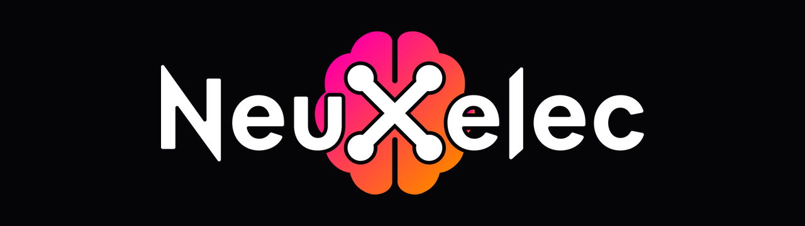

<div align="center">



### SEEG electrode reconstruction and 3D neuroimaging visualization

[](LICENSE)
[](https://neuxelec.com)
[](https://python.org)
[](https://neuxelec.com)

</div>

---

NeuXelec is a standalone desktop application for researchers working with
stereoelectroencephalography (SEEG). It covers the full post-implantation
workflow, from MRI/CT coregistration to electrode reconstruction, oblique
reslicing, parcellation and 3D visualization, including MNI-space group
analysis, without requiring any programming knowledge.

> **Research use only.** NeuXelec is not a certified medical device and must
> not be used as the sole basis for any clinical, diagnostic, or treatment
> decision.

Website and documentation: **https://neuxelec.com**

---

## Workflow

1. **Import & Coregistration** - align MRI, CT, PET and SPECT into a shared
   space (ANTs rigid registration), automatic brain masking, SISCOM.
2. **Electrode Reconstruction** - two clicks per electrode on the CT;
   automatic contact localization in millimetre coordinates.
3. **Oblique & Parcellation** - reslice along each electrode axis, blend
   modalities, map every contact to its anatomical region.
4. **3D View & Export** - render electrodes on the cortical surface, normalize
   to MNI152, export BIDS-compatible coordinates and publication figures.

---

## Installation

### Option A - Windows installer (end users)

Download the latest installer from **https://neuxelec.com/download** and run
it. No Python or dependencies required.

### Option B - From source (developers)

Requires **Python 3.10+** on Windows.

```bash
git clone <repository-url> NeuXelec
cd NeuXelec
python -m venv .venv
.venv\Scripts\activate
pip install -r requirements.txt
python scripts/run_neuxelec.py
```

External data not tracked in git (see `.gitignore`) and required at runtime:

- `tools/ants/` - ANTs executables (coregistration, MNI normalization).
- `templates/` - MNI152 template, brain mask and parcellation atlases.

---

## Project structure

```
src/neuxelec/
├── app.py                 # entry point: QApplication, logging, project loop
├── main_window.py         # main window, page lifecycle, safe teardown
├── state.py               # AppState - single source of truth
├── project_io.py          # project (.json) save / load, schema versioning
├── logging_config.py      # rotating file logging
├── coregistration.py      # ANTs coregistration wrappers
├── siscom.py              # SISCOM computation
├── controllers/           # interaction controllers (electrodes, menu)
├── pages/                 # the four workflow pages (files, recon, oblique, 3D)
├── ui/                    # dialogs and reusable widgets
├── workers/               # QThread workers for long-running tasks
└── utils/                 # imaging, coordinates, conversions, resources
resources/                 # Qt .ui files and images (icons, logo)
scripts/run_neuxelec.py    # dev launcher
tests/                     # pytest test suite
```

See [ARCHITECTURE.md](ARCHITECTURE.md) for the design and data flow.

---

## Development

```bash
pip install -r requirements.txt -r requirements-dev.txt

pytest                 # run the test suite
ruff check src tests   # lint
black src tests        # format
mypy                   # static type checking
```

See [CONTRIBUTING.md](CONTRIBUTING.md) for conventions.

---

## Building the executable

```bash
pyinstaller NeuXelec_windows.spec --clean --noconfirm
"C:\Program Files (x86)\Inno Setup 6\ISCC.exe" NeuXelec_setup.iss
```

This produces `installer/NeuXelec_Setup_<version>.exe`.

---

## License

Released under the **GNU General Public License v3.0 (GPL-3.0)**. You are free
to use, study, modify and redistribute NeuXelec, provided that any distributed
derivative work is also released under GPL-3.0 with its complete source code
made available. See [LICENSE](LICENSE) for the full text.

> **Research use only.** NeuXelec is not a certified medical device and must not
> be used as the sole basis for any clinical, diagnostic or treatment decision.

---

## Citation

If you use NeuXelec in your research, please cite:

```bibtex
@software{veber2026neuxelec,
  author      = {Veber, Jules},
  title       = {NeuXelec: an all-in-one application for stereo-EEG electrode reconstruction and multimodal brain visualization},
  year        = {2026},
  url         = {https://neuxelec.com},
  institution = {HUG Geneva, University of Geneva}
}
```

---

## Acknowledgements

NeuXelec builds on [**Voxeloc**](https://github.com/HumanNeuronLab/voxeloc)
(Monney et al., 2024), a MATLAB tool for SEEG electrode localization developed
in the Human Neuron Lab. NeuXelec reimplements its two-point localization
approach as a standalone Python application and extends it across the full SEEG
workflow (coregistration, SISCOM, oblique reslicing, parcellation, MNI
normalization and 3D visualization).

> Monney J, Dallaire SE, Stoutah L, Fanda L, Mégevand P. *Voxeloc: A
> time-saving graphical user interface for localizing and visualizing
> stereo-EEG electrodes.* Journal of Neuroscience Methods. 2024;407:110154.
> [doi:10.1016/j.jneumeth.2024.110154](https://doi.org/10.1016/j.jneumeth.2024.110154)

---

## Author

**Jules Veber** · Hôpitaux Universitaires de Genève (HUG) and the Human
Neuron Lab (HNL), University of Geneva · contact@neuxelec.com
